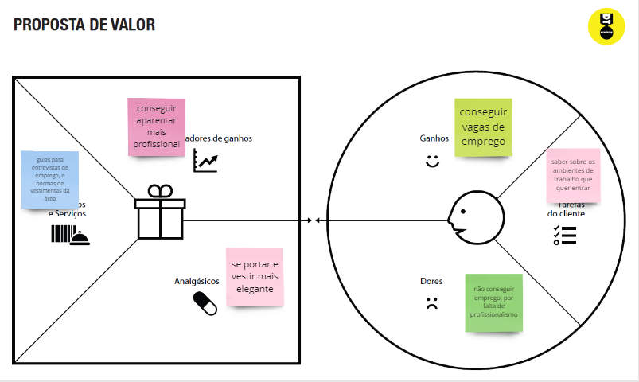

# Informações do Projeto
`TÍTULO DO PROJETO`  

Projeto Moda e Estilo

`CURSO` 

Ciência da Computação-Puc Minas

## Participantes

- Vitor Lucio de Oliveira
- Vitor Dias de Britto Militão
- Júlio César Gonzaga Ferreira Silva
- Pedro Henriques Guimarães da Silveira
- Julia Gabriela dos Santos Ramalho Aleluia
- Pedro Matoso

# Estrutura do Documento

- [Informações do Projeto](#informações-do-projeto)
  - [Participantes](#participantes)
- [Estrutura do Documento](#estrutura-do-documento)
- [Introdução](#introdução)
  - [Problema](#problema)
  - [Objetivos](#objetivos)
  - [Justificativa](#justificativa)
  - [Público-Alvo](#público-alvo)
- [Especificações do Projeto](#especificações-do-projeto)
  - [Personas, Empatia e Proposta de Valor](#personas-empatia-e-proposta-de-valor)
  - [Histórias de Usuários](#histórias-de-usuários)
  - [Requisitos](#requisitos)
    - [Requisitos Funcionais](#requisitos-funcionais)
    - [Requisitos não Funcionais](#requisitos-não-funcionais)
  - [Restrições](#restrições)
- [Projeto de Interface](#projeto-de-interface)
  - [User Flow](#user-flow)
  - [Wireframes](#wireframes)
- [Metodologia](#metodologia)
  - [Divisão de Papéis](#divisão-de-papéis)
  - [Ferramentas](#ferramentas)
  - [Controle de Versão](#controle-de-versão)
- [**############## SPRINT 1 ACABA AQUI #############**](#-sprint-1-acaba-aqui-)
- [Projeto da Solução](#projeto-da-solução)
  - [Tecnologias Utilizadas](#tecnologias-utilizadas)
  - [Arquitetura da solução](#arquitetura-da-solução)
- [Avaliação da Aplicação](#avaliação-da-aplicação)
  - [Plano de Testes](#plano-de-testes)
  - [Ferramentas de Testes (Opcional)](#ferramentas-de-testes-opcional)
  - [Registros de Testes](#registros-de-testes)
- [Referências](#referências)

# Introdução

## Problema
  
  Junto com a passagem do tempo as pessoas tendem a mudar seus gostos, e isso interfere diretamente com a moda. Tentar se manter "estiloso" ou "dentro da moda", sempre foi um desafio para alguns, tanto por falta de tempo para aprender quanto dinheiro para seguir. Mas infelizmente, no mundo atual, a imagem que você apresenta para os outros é fundamental para sua vivência social, tornando saber se vestir algo essencial. 

  Desta forma, muitos buscam se guiar através de símbolos da moda, “influencers” ou simplesmente o que outros ao redor usam. Entretendo tais métodos tão grandes chances de falhas por dois motivos: não ter acesso as roupas recomendadas e se as roupas combinaram com a pessoa. Isso causa frustação, baixa autoestima e desestimula a busca pelo estilo próprio. 

  Sendo assim, criando uma necessidade de canais confiáveis e personalizados de guia de vestimentas, sem a parcialidade de grandes empresas que querem vender seus produtos, e assim permitindo as pessoas explorarem o próprio estilo, mas mantendo uma boa estética social. 

## Objetivos

O objetivo geral deste trabalho é a criação de um guia virtual de moda que apresente ferramentas de fácil uso e tenha conteúdo personalizado para atender todas as características de uma pessoa. 

 
Como objetivos específicos, temos: 

*Fornecer funcionalidades que permitam interagir com conjuntos de roupas criadas por usuários, e conjuntos criados pela própria plataforma; 

*Permitir a criação de vários estilos e conjuntos com o aconselhamento da plataforma, para atender gostos individuais, mas se mantendo “bem-vestida”;

*Tornar o conhecimento de moda pessoal mais acessível, independente de genero ou condição social. 

## Justificativa

 A moda e a sua relação com o indivíduo e a sociedade, trata-se de uma relação que existe para além da necessidade básica de cobrir e proteger o corpo, mas de explora o mundo visual e identidade do ser humano.
 Além disso, com o advento da internet e das redes sociais, tornou-se mais fácil para as pessoas pesquisarem e acessarem informações sobre moda, seja por meio de blogs, fóruns, sites especializados ou influenciadores digitais. Dessa forma, é seguro afirmar que há um grande número de pessoas que pesquisam sobre moda e que esse número tende a crescer cada vez mais. 

## Público-Alvo

Embora todas as pessoas possam se beneficiar de um guia para se adequar a moda, que muda constantemente, o foco deste trabalho está no público que não consegue achar um estilo que encaixe em seu corpo e personalidade, e pessoas que precisam de roupas especificas para eventos específicos (entrevistas de empregos, festas, festivais, etc...) 

Portanto, como público-alvo temos homens e as mulheres entre 14 e 30 anos que se encontram na necessidade de se reinventar e tentar “looks” novos, mas não tem conhecimento de como começar. 

# Especificações do Projeto

A definição do problema neste projeto foi fundamentada por entrevistas e pesquisas de necessidades do mundo da moda realizadas pelos membros da equipe. Sendo representada por meio de personas criadas para atender as diferentes necessidades de usuários. 

## Personas, Empatia e Proposta de Valor

As personas e suas necessidades, criadas para maior entendeminto do problema, estão representadas nas imagens a seguir: 

> **Persona 1: Enzo**

> **Persona 2: Carlos**

> **Persona 3: Aninha**

> **Persona 4: Felipe**

## Histórias de Usuários

Com base na análise das personas forma identificadas as seguintes histórias de usuários:

|EU COMO... `PERSONA`| QUERO/PRECISO ... `FUNCIONALIDADE` |PARA ... `MOTIVO/VALOR`                 |
|--------------------|------------------------------------|----------------------------------------|
|Enzo                | Saber vestir para festas casuais           | Conseguir atrair pessoas e me sentir bonito                 |
|Carlos              | Saber vestir para encontros romanticos     | Ter mais confiança e chances de me relacionar romanticamente|
|Aninha              | Saber vestir para entrevistas profissionais| Ter maiores chances em vagas de emprego                     |
|Felipe              | Ferramenta acessivel para meus clientes    | Economizar tempo e satisfação de consumidor                 |

## Requisitos

As tabelas que se seguem apresentam os requisitos funcionais e não funcionais que detalham o escopo do projeto.

### Requisitos Funcionais

|ID    | Descrição do Requisito  | Prioridade |
|------|-----------------------------------------|----|
|RF-001| Permitir que o usuário cadastre seus dados (caracteristicas) | ALTA | 
|RF-002| Relacionar o banco de dados de roupas com os dados do usúario| ALTA |
|RF-003| Permitir o usúario a criar conjuntos guiados com o banco de roupas personalizado | ALTA |
|RF-004| Opção de publicar ou privar conjuntos para outros usúarios    | MÉDIA |
|RF-005| Possuir conjuntos exemplos para facilitar o aprendizado       | MÉDIA |
|RF-006| Opção de curtir/favoritar conjuntos publicos                  | BAIXA |

### Requisitos não Funcionais

|ID     | Descrição do Requisito  |Prioridade |
|-------|-------------------------|----|
|RNF-001| O sistema deve ser responsivo para rodar em um dispositivos móvel | MÉDIA | 
|RNF-002| Deve processar dados do usuário em no máximo 3s |  BAIXA | 
|RNF-003| Deve Atualizar dados de usúario a cada 10s |  BAIXA |
|RNF-004| O site deve ter dominio acessível (Repl.it, etc) | MEDIA |  
|RNF-004| O site deve ser compativel com principais navegadores (Opera, Chrome, FireFox) |ALTA |  

## Restrições

O projeto está restrito pelos itens apresentados na tabela a seguir.

|ID| Restrição                                             |
|--|-------------------------------------------------------|
|01| O projeto deverá ser entregue até o final do semestre |
|02| Não pode ser desenvolvido um módulo de backend        |

# Projeto de Interface

......  COLOQUE AQUI O SEU TEXTO DE INTRODUÇÃO ......

> Apresente as principais interfaces da solução. Discuta como 
> foram elaboradas de forma a atender os requisitos funcionais, não
> funcionais e histórias de usuário abordados nas [Especificações do
> Projeto](#especificações-do-projeto).

## User Flow

[Exemplo de UserFlow](images/userflow.jpg)

## Wireframes

......  INCLUA AQUI OS WIREFRAMES DAS TELAS DA APLICAÇÃO COM UM BREVE DESCRITIVO ......

> Wireframes são protótipos das telas da aplicação usados em design de interface para sugerir a
> estrutura de um site web e seu relacionamentos entre suas
> páginas. Um wireframe web é uma ilustração semelhante ao
> layout de elementos fundamentais na interface.
> 
> **Links Úteis**:
> - [Ferramentas de Wireframes](https://rockcontent.com/blog/wireframes/)
> - [Figma](https://www.figma.com/)
> - [Adobe XD](https://www.adobe.com/br/products/xd.html#scroll)
> - [MarvelApp](https://marvelapp.com/developers/documentation/tutorials/)
> 
> **Exemplo**:
> 
> 

# Metodologia

A metodologia contempla os meios utilizado pela equipe tanto para a manutenção dos códigos quanto os demais artefatos para a organização do time na execução das tarefas do projeto.

## Divisão de Papéis

A equipe utiliza metodologias ágeis, sendo o Scrum a base para definição do processo de desenvolvimento.

Divisão:

- Scrum Master: Vitor Lucio;

- Product Owner: Vitor Lucio;

Equipe de Desenvolvimento:

- Vitor Dias (Desenvolvedor Front End);
- Julio Cesar Silva (Desenvolvedor Back End);
- Pedro Henriques Guimarães (Analista de Negócios);
- Julia Gabriela (Designer);

## Ferramentas

Os artefatos do projeto são desenvolvidos a partir de diversas plataformas que são apresentadas na tabela a seguir:

| Ambiente  | Plataforma              |Link de Acesso |Motivo|
|-----------|-------------------------|---------------|---------------|
|Processo de Design Thinkgin  | Miro |  https://miro.com/XXXXXXX | Para melhor organização de ideias virtualmente  |
|Repositório de código | GitHub | https://github.com/XXXXXXX |  Ferramenta mais utilizada pelos membros do grupo  posteriormente |
|Hospedagem do site | Heroku |  https://XXXXXXX.herokuapp.com | Ferramenta mais utilizada pelos membros do grupo  posteriormente        |
|Protótipo Interativo | Figma | https://figma.com/XXXXXXX |  Ferramenta gratuita e simples de se usar |

## Controle de Versão

Para gestão do software desenvolvido pelo time, nossa equipe utiliza um processo baseado no Git Feature Branch Workflow, mostrado na Figura a seguir. Onde todas as alterações/manutenções do código são realizadas em branches separados, mantendo aberto as versões feitas por todos do grupo individualmente.

 

# **############## SPRINT 1 ACABA AQUI #############**

# Projeto da Solução

......  COLOQUE AQUI O SEU TEXTO ......

## Tecnologias Utilizadas

......  COLOQUE AQUI O SEU TEXTO ......

> Descreva aqui qual(is) tecnologias você vai usar para resolver o seu
> problema, ou seja, implementar a sua solução. Liste todas as
> tecnologias envolvidas, linguagens a serem utilizadas, serviços web,
> frameworks, bibliotecas, IDEs de desenvolvimento, e ferramentas.
> Apresente também uma figura explicando como as tecnologias estão
> relacionadas ou como uma interação do usuário com o sistema vai ser
> conduzida, por onde ela passa até retornar uma resposta ao usuário.
> 
> Inclua os diagramas de User Flow, esboços criados pelo grupo
> (stoyboards), além dos protótipos de telas (wireframes). Descreva cada
> item textualmente comentando e complementando o que está apresentado
> nas imagens.

## Arquitetura da solução

......  COLOQUE AQUI O SEU TEXTO E O DIAGRAMA DE ARQUITETURA .......

> Inclua um diagrama da solução e descreva os módulos e as tecnologias
> que fazem parte da solução. Discorra sobre o diagrama.
> 
> **Exemplo do diagrama de Arquitetura**:
> 
> 

# Avaliação da Aplicação

......  COLOQUE AQUI O SEU TEXTO ......

> Apresente os cenários de testes utilizados na realização dos testes da
> sua aplicação. Escolha cenários de testes que demonstrem os requisitos
> sendo satisfeitos.

## Plano de Testes

......  COLOQUE AQUI O SEU TEXTO ......

> Enumere quais cenários de testes foram selecionados para teste. Neste
> tópico o grupo deve detalhar quais funcionalidades avaliadas, o grupo
> de usuários que foi escolhido para participar do teste e as
> ferramentas utilizadas.
> 
> **Links Úteis**:
> - [IBM - Criação e Geração de Planos de Teste](https://www.ibm.com/developerworks/br/local/rational/criacao_geracao_planos_testes_software/index.html)
> - [Práticas e Técnicas de Testes Ágeis](http://assiste.serpro.gov.br/serproagil/Apresenta/slides.pdf)
> -  [Teste de Software: Conceitos e tipos de testes](https://blog.onedaytesting.com.br/teste-de-software/)

## Ferramentas de Testes (Opcional)

......  COLOQUE AQUI O SEU TEXTO ......

> Comente sobre as ferramentas de testes utilizadas.
> 
> **Links Úteis**:
> - [Ferramentas de Test para Java Script](https://geekflare.com/javascript-unit-testing/)
> - [UX Tools](https://uxdesign.cc/ux-user-research-and-user-testing-tools-2d339d379dc7)

## Registros de Testes

......  COLOQUE AQUI O SEU TEXTO ......

> Discorra sobre os resultados do teste. Ressaltando pontos fortes e
> fracos identificados na solução. Comente como o grupo pretende atacar
> esses pontos nas próximas iterações. Apresente as falhas detectadas e
> as melhorias geradas a partir dos resultados obtidos nos testes.

# Referências

......  COLOQUE AQUI O SEU TEXTO ......

> Inclua todas as referências (livros, artigos, sites, etc) utilizados
> no desenvolvimento do trabalho.
> 
> **Links Úteis**:
> - [Formato ABNT](https://www.normastecnicas.com/abnt/trabalhos-academicos/referencias/)
> - [Referências Bibliográficas da ABNT](https://comunidade.rockcontent.com/referencia-bibliografica-abnt/)
